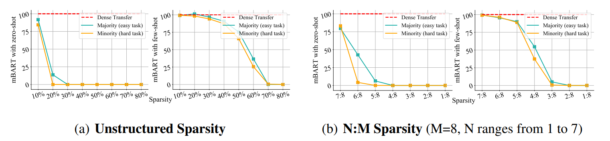

#  [Junk DNA Hypothesis: A Task-Centric Angle of LLM Pre-trained Weights through Sparsity)](https://arxiv.org/pdf/2310.02277.pdf)

Official PyTorch implementation of  **Junk DNA Hypothesis**: A Task-Centric Angle of LLM Pre-trained Weights through Sparsity 

[Lu Yin](https://luuyin.com//), [Shiwei Liu](https://shiweiliuiiiiiii.github.io/), [Ajay Jaiswal](https://ajay1994.github.io/), [Souvik Kundu](https://ksouvik52.github.io/), [Zhangyang Wang](https://vita-group.github.io/)

University of Texas at Austin, Eindhoven University of Technology

The code can be contacted at l.yin@tue.nl.

Table of contents
* [Installation](#installation)
* [Various Task Diffuclty](#various-task-diffculty)
* [Are Pre-trained Magnitude Values Indeed the True Gem?](#are-pre-trained-magnitude-values-indeed-the-true-gem?)

--- 

## Installation 
Please check [INSTALL.md](INSTALL.md) for installation instructinos.


## Various Task diffculty


We provide a quick overview of the arguments:  
- `--model_name_or_path`: The identifier for the model on the Hugging Face model hub.
- `--TASK_NAME`: the name of the fine-tuned tasks.
- `--sparsity`: Denotes the percentage of weights to be pruned.
- `--sparse_init`: Specifies the type of sparsity [`sparse_nm`, `sparse_unstuctured`] .
- `--method`: a flag to of the output_dir.


### Task Difficulty Setting 1: Varying the Adequacy of Target Domain Data
--- 
### Scripts example

```
cd ./GLUE_tasks
for seed in 41 
do
  for TASK_NAME in qnli  
  do 
    for sparsity in 0.1 0.2 0.3 0.4 0.5 0.6 0.7 0.8 0.9
    do
      for validation_split_percentage in 10 25 50 75 100
      do
      python Glue_prune_oneshot.py \
        --method Glue_noembed_freeze_weights \
        --validation_split_percentage $validation_split_percentage \
        --freeze_weights \
        --noembed \
        --sparsity $sparsity \
        --model_name_or_path roberta-base \
        --task_name $TASK_NAME \
        --max_length 128 \
        --per_device_train_batch_size 32 \
        --learning_rate 2e-5 \
        --num_train_epochs 3 \
        --seed $seed \
        --output_dir ./roberta/Glue_noembed_freeze_weights/$TASK_NAME/$sparsity/$validation_split_percentage/$seed/
      done
    done
  done
done
```

### Results


<p align="center">

</p>


### Task Difficulty Setting 2: Majority v.s. Minority in Multi-Domain Learning
--- 

### Results

<p align="center">

</p>


### Task Difficulty Setting 3: With v.s. Without Available External Information
--- 

### Results
<p align="center">

</p>


### Task Difficulty Setting 4: Estimating LLM-facing Task Difficulty by Normalized Human-LLM Performance Gap
--- 

### Scripts example

```
cd ./GLUE_tasks
for seed in 41 42 43
do
  for TASK_NAME in cola sst2
  do 
    for sparsity in 0.1 0.2 0.3 0.4 0.5 0.6 0.7 0.8 0.9
    do
      for validation_split_percentage in 100
      do
      python Glue_prune_oneshot.py \
        --method Glue_noembed_freeze_weights \
        --validation_split_percentage $validation_split_percentage \
        --freeze_weights \
        --noembed \
        --sparsity $sparsity \
        --model_name_or_path roberta-large \
        --task_name $TASK_NAME \
        --max_length 512 \
        --per_device_train_batch_size 16 \
        --learning_rate 2e-5 \
        --num_train_epochs 3 \
        --seed $seed \
        --output_dir ./roberta/Glue_noembed_freeze_weights/$TASK_NAME/$sparsity/$validation_split_percentage/$seed/
      done
    done
  done
done


```
### Results

<p align="center">

</p>

## Are Pre-trained Magnitude Values Indeed the True Gem?

### Scripts example

```

cd ./GLUE_tasks 

for seed in 41 42 43
do
  for TASK_NAME in QNLI 
  do 
    for sparsity in 0.1 0.2 0.3 0.4 0.5 0.6 0.7 0.8 0.9
    do
      for validation_split_percentage in 100
      do
      python Glue_prune_oneshot.py \
        --method Glue_noembed_freeze_weights \
        --validation_split_percentage $validation_split_percentage \
        -- freeze_weights\
        --noembed \
        --sparsity $sparsity \
        --model_name_or_path roberta-large \
        --task_name $TASK_NAME \
        --max_length 512 \
        --per_device_train_batch_size 16 \
        --learning_rate 2e-5 \
        --num_train_epochs 3 \
        --seed $seed \
        --output_dir ./roberta/Glue_noembed_freeze_weights/$TASK_NAME/$sparsity/$validation_split_percentage/$seed/
      done
    done
  done
done


```

### Results
<p align="center">

</p>


## Citation
if you find this repo is helpful, please cite

```

```
